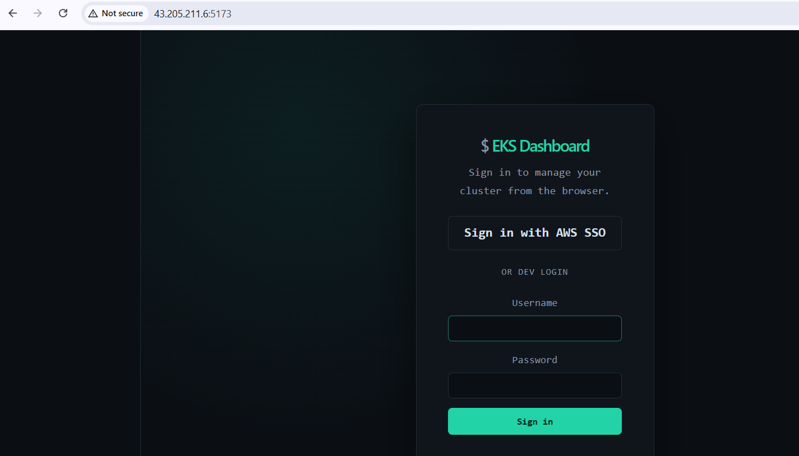
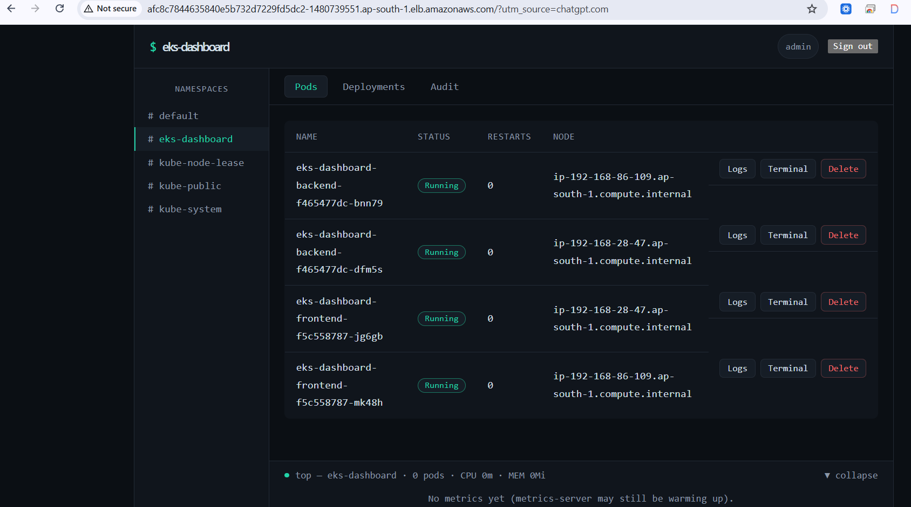
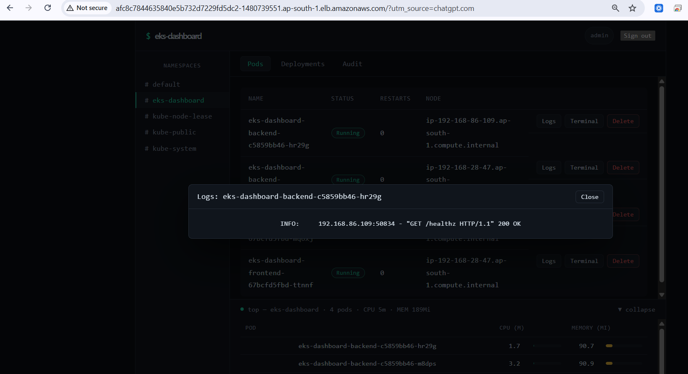

# EKS Dashboard on AWS EKS --- Phase 1

A hands-on DevOps project to deploy a Kubernetes dashboard application
on **Amazon EKS** with containerized frontend/backend services, AWS IAM
Pod Identity, Kubernetes RBAC, metrics, and live pod log streaming.

> **Phase 1 status:** Completed successfully --- application deployed
> and stable on EKS.

------------------------------------------------------------------------

## 1. What I Built

The project provides a web dashboard for managing and observing
Kubernetes workloads.

### Main capabilities

-   Kubernetes namespaces and pods
-   Pod status and restart information
-   Deployments
-   Services
-   Pod CPU and memory metrics
-   Pod logs through WebSocket streaming
-   Pod operations such as delete
-   Deployment operations such as scale/restart
-   Audit information
-   Frontend exposed through an AWS Load Balancer
-   Backend kept internal as a Kubernetes `ClusterIP`

------------------------------------------------------------------------

## 2. Architecture

``` text
                        Internet
                           |
                           v
              +--------------------------+
              | AWS Load Balancer        |
              | Frontend Service :80     |
              +------------+-------------+
                           |
                           v
              +--------------------------+
              | Frontend                  |
              | React/Vite + Nginx        |
              | 2 Pods                    |
              +------------+-------------+
                           |
             /api /auth /ws|
                           v
              +--------------------------+
              | Backend                   |
              | FastAPI + Python          |
              | 2 Pods :8000              |
              +------------+-------------+
                           |
                           v
              +--------------------------+
              | Kubernetes API            |
              | EKS Cluster               |
              +--------------------------+

        Metrics -----------------> Metrics Server
        IAM permissions ----------> EKS Pod Identity
        Kubernetes permissions ---> RBAC
```

------------------------------------------------------------------------

## 3. Technologies Used

  Area                Technology
  ------------------- ----------------------
  Cloud               AWS
  Kubernetes          Amazon EKS
  Container Runtime   Docker
  Frontend            React / Vite / Nginx
  Backend             Python / FastAPI
  Registry            Amazon ECR
  IAM                 EKS Pod Identity
  Authorization       Kubernetes RBAC
  Metrics             Metrics Server
  Cluster creation    eksctl
  CLI                 AWS CLI, kubectl
  Source Control      Git / GitHub

------------------------------------------------------------------------

## 4. Environment

### AWS

-   Region: `ap-south-1`
-   EKS cluster: `eks-dashboard`
-   Kubernetes version: `1.36`
-   Node type: `t3.medium`
-   Desired nodes: `2`
-   Node volume: `30 GB gp3`

The EKS cluster was created with OIDC enabled and the required EKS
add-ons.

### Local / EC2 tools

-   AWS CLI
-   kubectl
-   eksctl
-   Docker
-   Git
-   Python
-   Node.js

------------------------------------------------------------------------

## 5. Project Structure

``` text
EKS-Dashboard/
├── backend/
│   ├── app/
│   ├── Dockerfile
│   └── requirements.txt
├── frontend/
│   ├── src/
│   ├── Dockerfile
│   └── nginx.conf
├── k8s-backend-rbac.yaml
├── k8s-backend.yaml
├── k8s-frontend.yaml
├── scripts/
└── README.md
```

------------------------------------------------------------------------

## 6. Deployment Process

### Step 1 --- Clone the source project

The original project was cloned locally and then customized for my
AWS/EKS environment.

``` bash
git clone <source-repository>
cd EKS-Dashboard
```

------------------------------------------------------------------------

### Step 2 --- Create the EKS cluster

I created the `eks-dashboard` EKS cluster in `ap-south-1` using
`eksctl`.

The cluster configuration included:

-   Kubernetes 1.36
-   2 managed `t3.medium` nodes
-   gp3 EBS volumes
-   OIDC
-   VPC CNI
-   CoreDNS
-   kube-proxy
-   AWS EBS CSI driver

After creation I verified:

``` bash
kubectl get nodes
```

Both nodes became `Ready`.

------------------------------------------------------------------------

### Step 3 --- Deploy the Kubernetes application

The application manifests define the frontend, backend, services and
RBAC.

``` bash
kubectl apply -f k8s-backend-rbac.yaml
kubectl apply -f k8s-backend.yaml
kubectl apply -f k8s-frontend.yaml
```

The backend service is internal:

``` text
eks-dashboard-backend   ClusterIP   :8000
```

The frontend service is externally accessible:

``` text
eks-dashboard-frontend  LoadBalancer :80
```

------------------------------------------------------------------------

## 7. Container Images and ECR

I built separate Docker images for the frontend and backend.

### Backend

``` bash
docker build --no-cache -t eks-dashboard-backend:latest ./backend
```

### Frontend

``` bash
docker build --no-cache -t eks-dashboard-frontend:latest ./frontend
```

The images were tagged and pushed to Amazon ECR.

ECR authentication:

``` bash
aws ecr get-login-password --region ap-south-1 \
| docker login --username AWS \
--password-stdin 274955213592.dkr.ecr.ap-south-1.amazonaws.com
```

------------------------------------------------------------------------

## 8. IAM Pod Identity

The backend needs AWS permissions to interact with EKS.

Instead of storing AWS access keys inside the container, I configured
**EKS Pod Identity**.

The backend service account was associated with:

``` text
IAM Role:
EKS-Dashboard-Backend-PodRole
```

The role was given the required `eks:DescribeCluster` permission.

I verified the credentials from inside the backend pod using:

``` bash
aws sts get-caller-identity
```

The pod correctly received the assumed IAM role.

------------------------------------------------------------------------

## 9. Kubernetes RBAC

The backend also needs permission to read and operate Kubernetes
resources.

I configured:

-   Kubernetes ServiceAccount
-   ClusterRole
-   ClusterRoleBinding
-   EKS Access Entry
-   IAM group mapping

A key troubleshooting point was that the IAM-authenticated backend
requests required the Kubernetes group binding:

``` text
eks-dashboard-backend
        |
        v
ClusterRoleBinding
        |
        v
ClusterRole: eks-dashboard-backend
```

After creating the required access entry and group binding, the
dashboard stopped returning `403 Forbidden` responses.

------------------------------------------------------------------------

## 10. Metrics

I installed Kubernetes Metrics Server:

``` bash
kubectl apply -f https://github.com/kubernetes-sigs/metrics-server/releases/latest/download/components.yaml
```

Then verified:

``` bash
kubectl top nodes
kubectl top pods -n eks-dashboard
```

The dashboard was then able to display CPU and memory usage for pods.

------------------------------------------------------------------------

## 11. Frontend Nginx Reverse Proxy

The frontend uses Nginx to proxy API traffic to the internal backend
service.

``` text
Browser
   |
   v
Frontend Nginx
   |
   +---- /api/  ---> Backend
   +---- /auth/ ---> Backend
   +---- /ws/   ---> Backend WebSocket
```

This keeps the backend service internal to the EKS cluster.

------------------------------------------------------------------------

## 12. WebSocket Logs --- Troubleshooting

One of the main issues in Phase 1 was that the **Logs** window initially
opened but did not display logs correctly.

### Investigation

The browser successfully established the WebSocket connection, but the
backend became unhealthy and Kubernetes restarted the container.

The backend liveness probe was failing with timeout errors.

The root cause was the blocking Kubernetes log stream:

``` python
resp.stream(...)
```

being consumed directly inside the asynchronous FastAPI event loop.

This blocked the event loop while waiting for new log data.

### Fix

I moved the blocking stream reads into a thread executor:

``` python
def _read_line():
    return next(resp.stream(amt=1024, decode_content=True), None)

while True:
    line = await loop.run_in_executor(None, _read_line)

    if line is None:
        break

    await websocket.send_text(...)
```

I first validated the Python file:

``` bash
python3 -m py_compile backend/app/routers/ws_logs.py
```

Then rebuilt and pushed the backend image and restarted the deployment.

------------------------------------------------------------------------

## 13. Final Verification

After the fix:

``` bash
kubectl get pods -n eks-dashboard
```

Result:

``` text
eks-dashboard-backend-c5859bb46-hr29g   1/1   Running   0
eks-dashboard-backend-c5859bb46-m8dps   1/1   Running   0

eks-dashboard-frontend-67bcfd5fbd-mq6xj  1/1   Running   0
eks-dashboard-frontend-67bcfd5fbd-ttnnf  1/1   Running   0
```

Rollout verification:

``` bash
kubectl rollout status deployment/eks-dashboard-backend -n eks-dashboard
```

Result:

``` text
deployment "eks-dashboard-backend" successfully rolled out
```

### Final services

``` text
eks-dashboard-backend
TYPE: ClusterIP
PORT: 8000

eks-dashboard-frontend
TYPE: LoadBalancer
PORT: 80
```

------------------------------------------------------------------------

## 14. Application Screenshots

### 1. Dashboard Login



### 2. Kubernetes Dashboard



### 3. Live Pod Logs



------------------------------------------------------------------------

## 15. Phase 1 Completion Checklist

-   [x] AWS EC2 environment prepared
-   [x] EKS cluster created
-   [x] EKS managed nodes created
-   [x] Kubernetes application deployed
-   [x] Frontend containerized
-   [x] Backend containerized
-   [x] Docker images pushed to ECR
-   [x] Frontend exposed using AWS LoadBalancer
-   [x] Backend exposed internally using ClusterIP
-   [x] EKS Pod Identity configured
-   [x] Kubernetes RBAC configured
-   [x] EKS Access Entry configured
-   [x] Metrics Server installed
-   [x] CPU/memory metrics verified
-   [x] Dashboard login verified
-   [x] Pod logs verified
-   [x] WebSocket live streaming fixed
-   [x] Backend rollout verified
-   [x] Backend stable with 0 restarts

------------------------------------------------------------------------

## 16. Important Security Notes

The current setup is suitable for a lab/project environment, not
production.

Before production deployment:

-   Disable the development login.
-   Replace the default JWT secret.
-   Use HTTPS/TLS.
-   Avoid hard-coded credentials.
-   Use immutable Docker image tags/digests.
-   Enable ECR image scanning.
-   Restrict EKS endpoint access instead of `0.0.0.0/0`.
-   Review Kubernetes RBAC permissions using least privilege.
-   Store secrets using AWS Secrets Manager or another secure
    secret-management solution.

------------------------------------------------------------------------

## 17. Next Phase

Possible Phase 2 improvements:

-   Jenkins CI/CD pipeline
-   SonarQube code quality
-   Trivy security scanning
-   Automated Docker image build/push
-   Automated EKS deployment
-   Argo CD GitOps
-   Prometheus and Grafana monitoring
-   HTTPS with ACM
-   Route 53 DNS
-   Production-grade secrets management
-   Terraform infrastructure as code

------------------------------------------------------------------------

## 18. Author

**Rajesh Chilukuri**\
DevOps Engineer

Technologies demonstrated in this phase:

`AWS | EKS | Kubernetes | Docker | ECR | IAM | Pod Identity | RBAC | FastAPI | React | Nginx | Metrics Server | Git`
